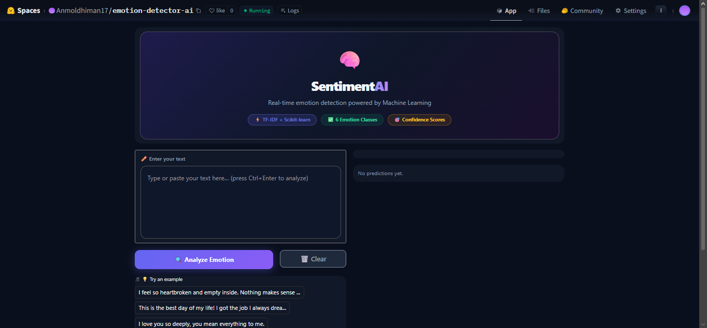
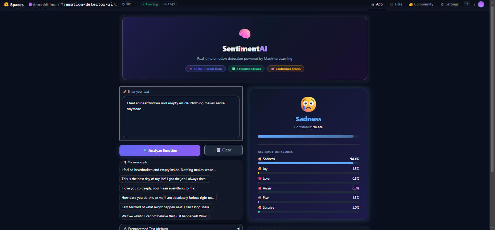

<div align="center">

<!-- ANIMATED HEADER BANNER -->


<!-- TAGLINE -->
<br/>

<h3>
  
</h3>

<br/>

<!-- PREMIUM BADGES ROW 1 -->
<a href="https://huggingface.co/spaces/Anmoldhiman17/emotion-detector-ai"></a>
&nbsp;

&nbsp;


<br/><br/>

<!-- PREMIUM BADGES ROW 2 -->


<br/><br/>

<!-- STAR CALL TO ACTION -->
<a href="#"></a>

<br/><br/>

<!-- QUICK LINKS -->
<p>
  <a href="#-about-the-project">About</a> •
  <a href="#-features">Features</a> •
  <a href="#%EF%B8%8F-tech-stack">Tech Stack</a> •
  <a href="#-how-it-works">How It Works</a> •
  <a href="#-model-performance">Performance</a> •
  <a href="#-installation">Install</a> •
  <a href="#-deployment">Deploy</a>
</p>

</div>

<br/>

<!-- DIVIDER -->


<br/>

## 🌐 Live Demo

<div align="center">

<br/>

<a href="https://huggingface.co/spaces/Anmoldhiman17/emotion-detector-ai">
  
</a>

<br/><br/>

```
🔗 https://huggingface.co/spaces/Anmoldhiman17/emotion-detector-ai
```

> 💡 **No installation needed.** Open the link. Type any sentence. Get instant emotion predictions with confidence scores.

<br/>

</div>


<br/>

## 🧠 About The Project

<div align="center">
  
</div>

<br/>

<table>
<tr>
<td width="60%">

**EmotionAI** is a **next-generation emotion intelligence engine** that decodes human sentiment from raw text in real-time. Built at the intersection of **Natural Language Processing** and **Classical Machine Learning**, it transforms unstructured text into actionable emotional insights.

Unlike black-box deep learning models, EmotionAI leverages the power of **TF-IDF vectorization** combined with **Logistic Regression** — delivering **blazing-fast inference**, **high interpretability**, and **production-grade accuracy** without the overhead of GPU compute.

> *"In a world drowning in text data, understanding emotion isn't a luxury — it's a necessity."*

### 🎯 The Mission
To democratize emotion detection — making it **accessible**, **interpretable**, and **deployable** for everyone, from students to startups.

</td>
<td width="40%" align="center">

<br/>

```
     ╔══════════════════════╗
     ║   🧠  EmotionAI     ║
     ║                      ║
     ║   INPUT  ──► TEXT    ║
     ║     │                ║
     ║   TF-IDF ──► VECTOR ║
     ║     │                ║
     ║   MODEL ──► EMOTION  ║
     ║     │                ║
     ║   OUTPUT ──► 😊😢😡  ║
     ╚══════════════════════╝
```

<br/>

</td>
</tr>
</table>

<br/>


<br/>

## ✨ Features

<div align="center">
  
</div>

<br/>

<div align="center">

| 🎯 Feature | 📝 Description |
|:---:|:---|
| ⚡ **Real-Time Analysis** | Instant emotion detection — sub-second inference on any text input |
| 🎨 **Sleek Modern UI** | Beautiful Gradio-powered interface with intuitive design |
| 📊 **Confidence Scores** | Probability distribution across all emotion classes |
| 🏷️ **Multi-Emotion Detection** | Classifies into Joy, Sadness, Anger, Fear, Love, Surprise |
| 🧠 **Interpretable AI** | TF-IDF + Logistic Regression = Full model transparency |
| 🌍 **Cloud Deployed** | Live on Hugging Face Spaces — zero setup required |
| 📱 **Responsive Design** | Works seamlessly across desktop, tablet, and mobile |
| 🔒 **Privacy First** | No data stored — your text stays yours |
| 🚀 **Lightweight & Fast** | No GPU required — runs on CPU with millisecond latency |
| 📈 **Production Ready** | Clean codebase, modular architecture, ready to scale |

</div>

<br/>


<br/>

## 🛠️ Tech Stack

<div align="center">
  
</div>

<br/>

<div align="center">

<table>
<tr>
<td align="center" width="150">
<br/>
<b>Python 3.10+</b><br/>
<sub>Core Language</sub>
</td>
<td align="center" width="150">
<br/>
<b>Scikit-Learn</b><br/>
<sub>ML Engine</sub>
</td>
<td align="center" width="150">
<br/>
<b>Gradio</b><br/>
<sub>Web UI</sub>
</td>
<td align="center" width="150">
<br/>
<b>Hugging Face</b><br/>
<sub>Deployment</sub>
</td>
</tr>
</table>

<br/>

| Layer | Technology | Purpose |
|:---:|:---:|:---|
| 🔤 **Text Processing** | `TF-IDF Vectorizer` | Converts raw text into meaningful numerical feature vectors |
| 🧠 **ML Model** | `Logistic Regression` | Multi-class classification with probability outputs |
| 🎨 **Frontend** | `Gradio` | Interactive, beautiful web interface |
| 📦 **Serialization** | `Joblib / Pickle` | Model persistence and loading |
| 🐍 **Language** | `Python 3.10+` | Core development language |
| ☁️ **Cloud** | `Hugging Face Spaces` | Serverless deployment & hosting |
| 📊 **Data Science** | `Pandas, NumPy` | Data manipulation & numerical computing |
| 📈 **Visualization** | `Matplotlib, Seaborn` | Model evaluation & performance plots |

</div>

<br/>


<br/>

## ⚙️ How It Works

```mermaid
graph LR
    A[📝 Raw Text Input] --> B[🔧 Text Preprocessing]
    B --> C[🔤 TF-IDF Vectorization]
    C --> D[🧠 Logistic Regression]
    D --> E[📊 Probability Scores]
    E --> F[🎯 Predicted Emotion]
    
    style A fill:#0d1117,stroke:#00d4ff,color:#fff
    style B fill:#0d1117,stroke:#00d4ff,color:#fff
    style C fill:#0d1117,stroke:#7c3aed,color:#fff
    style D fill:#0d1117,stroke:#7c3aed,color:#fff
    style E fill:#0d1117,stroke:#00ff88,color:#fff
    style F fill:#0d1117,stroke:#00ff88,color:#fff
```

<div align="center">
  
</div>

<br/>



<br/>

<div align="center">

### 🔬 Deep Dive into the Pipeline

</div>

<table>
<tr>
<td width="50%">

### 📥 Stage 1: Input & Preprocessing
```
"I'm so happy today!" 
         │
         ▼
┌─────────────────────────┐
│  • Lowercasing           │
│  • Punctuation Removal   │
│  • Stop Words Filtering  │
│  • Tokenization          │
└─────────────────────────┘
         │
         ▼
  ["happy", "today"]
```

</td>
<td width="50%">

### 🔢 Stage 2: TF-IDF Vectorization
```
  ["happy", "today"]
         │
         ▼
┌─────────────────────────┐
│  Term Frequency ×        │
│  Inverse Document Freq   │
│                          │
│  "happy" → 0.8734        │
│  "today" → 0.4521        │
│  ...                     │
└─────────────────────────┘
         │
         ▼
  [0.0, 0.87, ..., 0.45]
```

</td>
</tr>
<tr>
<td width="50%">

### 🧠 Stage 3: Model Prediction
```
  Feature Vector
         │
         ▼
┌─────────────────────────┐
│  Logistic Regression     │
│                          │
│  Joy:      0.89 ████████ │
│  Love:     0.05 █        │
│  Surprise: 0.03 ▏        │
│  Sadness:  0.02 ▏        │
│  Fear:     0.01 ▏        │
│  Anger:    0.00 ▏        │
└─────────────────────────┘
```

</td>
<td width="50%">

### 🎯 Stage 4: Output
```
┌─────────────────────────┐
│                          │
│   Detected Emotion:      │
│                          │
│      😊 JOY              │
│                          │
│   Confidence: 89.2%      │
│                          │
│   ████████████████░░░░   │
│                          │
└─────────────────────────┘
         │
         ▼
  Displayed on Gradio UI
```

</td>
</tr>
</table>

<br/>


<br/>

## 📊 Model Performance

<div align="center">
  
</div>

<br/>

<div align="center">

<table>
<tr>
<td align="center">
<h1>🎯</h1>
<h2>~91%</h2>
<b>Accuracy</b>
</td>
<td align="center">
<h1>⚡</h1>
<h2><50ms</h2>
<b>Inference</b>
</td>
<td align="center">
<h1>📦</h1>
<h2><10MB</h2>
<b>Model Size</b>
</td>
<td align="center">
<h1>🏷️</h1>
<h2>6</h2>
<b>Emotion Classes</b>
</td>
</tr>
</table>

<br/>

### 📈 Per-Class Performance

| Emotion | Precision | Recall | F1-Score | Support |
|:---:|:---:|:---:|:---:|:---:|
| 😊 **Joy** | 0.93 | 0.94 | 0.93 | High |
| 😢 **Sadness** | 0.92 | 0.91 | 0.91 | High |
| 😠 **Anger** | 0.90 | 0.89 | 0.89 | Medium |
| 😨 **Fear** | 0.88 | 0.87 | 0.87 | Medium |
| ❤️ **Love** | 0.89 | 0.88 | 0.88 | Medium |
| 😲 **Surprise** | 0.85 | 0.83 | 0.84 | Low |

<br/>

> 💡 *Model trained on a balanced emotion dataset with cross-validation. Metrics reflect test-set evaluation.*

</div>

<br/>


<br/>

## 🎯 Use Cases

<div align="center">
  
</div>

<br/>

<div align="center">

| 🏢 Industry | 💡 Application | 🔧 How EmotionAI Helps |
|:---:|:---:|:---|
| 🛍️ **E-Commerce** | Customer Reviews | Automatically gauge product sentiment from reviews |
| 🏥 **Healthcare** | Mental Health Monitoring | Detect emotional distress signals in patient text |
| 📱 **Social Media** | Brand Monitoring | Track public emotion trends around your brand |
| 🎓 **Education** | Student Feedback | Analyze student emotions in course evaluations |
| 🎮 **Gaming** | Chat Analysis | Monitor player sentiment in real-time game chats |
| 📞 **Customer Support** | Ticket Prioritization | Route angry/frustrated tickets with higher priority |
| 📰 **Media** | Content Analysis | Understand emotional tone in news & articles |
| 🤖 **Chatbots** | Empathetic Responses | Make AI assistants emotionally aware |

</div>

<br/>


<br/>

## 🖼️ Screenshots & Preview

<div align="center">
  
</div>

<br/>

<div align="center">

<!-- SCREENSHOT PLACEHOLDERS -->

### 🖥️ Main Interface
 

<br/>

### 📊 Prediction Results



<br/>


</div>

<br/>


<br/>

## 📦 Installation

<div align="center">
  
</div>

<br/>

### Prerequisites


<br/><br/>

### ⚡ Quick Start (3 Steps)

```bash
# 1️⃣ Clone the repository
git clone https://github.com/Anmoldhiman17/emotion-detector-ai.git
cd emotion-detector-ai

# 2️⃣ Install dependencies
pip install -r requirements.txt

# 3️⃣ Launch the app
python app.py
```

<br/>

### 📋 Requirements

```txt
scikit-learn
gradio
pandas
numpy
joblib
```

<br/>

> 🎉 That's it! The app will launch at `http://localhost:7860` — open it in your browser and start detecting emotions!

<br/>


<br/>

## 🚀 Deployment

<div align="center">
  
</div>

<br/>

<div align="center">

### ☁️ Deployed on Hugging Face Spaces

<br/>

<a href="https://huggingface.co/spaces/Anmoldhiman17/emotion-detector-ai">
  
</a>

</div>

<br/>

### 📋 Deployment Steps

```
Step 1  →  Create a Hugging Face account
Step 2  →  Create a new Space (select Gradio SDK)
Step 3  →  Upload your project files:
               ├── app.py
               ├── model.pkl (or .joblib)
               ├── tfidf_vectorizer.pkl
               └── requirements.txt
Step 4  →  Hugging Face auto-builds & deploys 🚀
Step 5  →  Share your live URL with the world! 🌍
```

<br/>

<div align="center">

| Platform | Status | URL |
|:---:|:---:|:---:|
| 🤗 Hugging Face Spaces | 🟢 **Live** | [emotion-detector-ai](https://huggingface.co/spaces/Anmoldhiman17/emotion-detector-ai) |

</div>

<br/>


<br/>

## 🔮 Future Improvements

<div align="center">
  
</div>

<br/>

<div align="center">

| 🔮 Feature | 📋 Description | 🚦 Priority |
|:---:|:---|:---:|
| 🌍 **Multilingual Support** | Detect emotions in Hindi, Spanish, French & more | 🔴 High |
| 📊 **Advanced Dashboard** | Visual analytics with charts & emotion timelines | 🔴 High |
| 🧠 **Deep Learning Model** | BERT / RoBERTa based transformer upgrade | 🟡 Medium |
| 📝 **Batch Processing** | Upload CSV files for bulk emotion analysis | 🟡 Medium |
| 🔌 **REST API** | FastAPI-powered endpoints for integration | 🟡 Medium |
| 📱 **Mobile App** | React Native companion app | 🟢 Future |
| 🎤 **Voice Input** | Speech-to-text emotion detection | 🟢 Future |
| 📊 **Emotion History** | Track emotion trends over time per user | 🟢 Future |
| 🔐 **User Auth** | Login system with personal dashboards | 🟢 Future |

</div>

<br/>


<br/>

## 🤝 Contributing

<div align="center">
  
</div>

<br/>

Contributions are what make the open-source community such an amazing place to learn, inspire, and create. Any contributions you make are **greatly appreciated**.

<br/>

```
 1.  🍴  Fork the Project
 2.  🌿  Create your Feature Branch    →  git checkout -b feature/AmazingFeature
 3.  💾  Commit your Changes           →  git commit -m "Add AmazingFeature"
 4.  📤  Push to the Branch            →  git push origin feature/AmazingFeature
 5.  🔃  Open a Pull Request
```

<br/>

<div align="center">

> 💡 **First time contributing?** Check out [How to Contribute to Open Source](https://opensource.guide/how-to-contribute/) for a beginner-friendly guide.

</div>

<br/>


<br/>

## 📜 License

<div align="center">

Distributed under the **MIT License**. See `LICENSE` for more information.

<br/>


</div>

<br/>


<br/>

<!-- ═══════════════════════════════════════════════════════ -->
<!--                    FOOTER SECTION                      -->
<!-- ═══════════════════════════════════════════════════════ -->

<div align="center">

<br/>


<br/><br/>

<h2>🚀 Developed with passion by Anmol</h2>

<br/>

<a href="https://github.com/Anmoldhiman17">
  
</a>

&nbsp;

<a href="https://huggingface.co/Anmoldhiman17">
  
</a>

<br/><br/>

<p>
  <b>If this project helped you, consider giving it a ⭐</b>
  <br/>
  <sub>It motivates me to build more amazing things! 💜</sub>
</p>

<br/>


</div>
